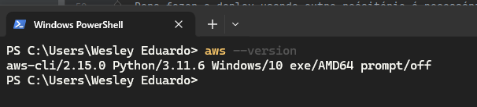

## Swagger da API rodando na Amazon EC2
- http://ec2-44-201-16-4.compute-1.amazonaws.com/crud-api/swagger-ui/index.html

## Requisitos Gerais
- Docker/WSL2 instalado, configurado e executando no ambiente Windows. Sugestão(https://github.com/codeedu/wsl2-docker-quickstart)
- Java 17 configurado nas variáveis de ambiente do Windows. Sugestão(https://corretto.aws/downloads/latest/amazon-corretto-17-x64-windows-jdk.zip)
- Maven 3+ configurado nas variáveis de ambiente do Windows. Sugestão(https://dlcdn.apache.org/maven/maven-3/3.9.6/source/apache-maven-3.9.6-src.zip)

## Executar aplicação localmente via linha de comando
- Abrir um terminal na pasta do projeto backend (/crud-angular-spring-deploy-aws-docker-postgres-terraform/backend)
- Executar comando "mvn clean install" para gerar o JAR da aplicação
- Ainda com o terminal na pasta backend, executar "docker compose up -d" para subir o banco de dados postgres
- Entrar no diretório /target
- Executar: java -jar crud-api-0.0.1-SNAPSHOT.jar
- Swagger: http://localhost:8080/crud-api/swagger-ui.html

## Executar aplicação localmente via IDE
- Abrir um terminal na pasta do projeto backend (/crud-angular-spring-deploy-aws-docker-postgres-terraform/backend)
- Executar "docker compose up -d" para subir o banco de dados postgres
- Subir via IDE
- Swagger: http://localhost:8080/crud-api/swagger-ui.html

## Executar aplicação localmente via Docker
- Abrir um terminal na pasta do projeto backend (/crud-angular-spring-deploy-aws-docker-postgres-terraform/backend )
- Executar comando "mvn clean install" para gerar o JAR da aplicação
- Executar o comando "docker build -t wesleyeduardodev/crud-api ." para gerar a imagem da aplicação 
- Executar "docker compose -f docker-compose-dev.yml up -d" para subir o banco de dados postgres e a aplicação
- Swagger: http://localhost:8080/crud-api/swagger-ui.html

## Executar aplicação via Shell Script e Docker
- Opção 1: Abrir pasta backend sem ser pelo terminal (explorar via windows) e executar o arquivo run-backend.sh
- Opção 2: Abrir um terminal no diretório backend e executar: sh run-backend.sh
- Swagger: http://localhost:8080/crud-api/swagger-ui.html

## Enviar imagem a aplicação para o Docker Hub
- Criar um conta no Docker Hub
- Abrir um terminal na pasta do projeto backend (/crud-angular-spring-deploy-aws-docker-postgres-terraform/backend )
- Execute o comando "mvn clean install" para gerar o JAR da aplicação
- Execute o comando "docker build -t wesleyeduardodev/crud-api ." para gerar a imagem da aplicação
- Abra um terminal do WSL2/Linux ou até mesmo do PowerShell/CMD e digite o comando "docker images" para verificar a imagem criada
- 
- Execute o comando "docker login" para logar/sincronizar com a conta no Docker Hub
- 
- Execute o comando "docker push wesleyeduardodev/crud-api" para enviar a imagem para o Docker Hub
- 
- 

## Pontos importantes sobre o deploy na AWS antes de executar os comandos do Terraform no contexto desse projeto
- Existem várias maneiras de fazer deploy de uma API na AWS. Essa que está sendo mostrado é apenas uma forma básica usada para fins de testes
- O uso do Terraform é para facilar o processo de criação e configuração de recursos na AWS
- O arquivo userdata.tpl presente no diretório terraform contém instruções do que será executado no ambiente Linux quando a máquina EC2 for iniciada. Isso envolve instação de atualizações, docker e etc...
- Ainda falando sobre o arquivo userdata.tpl, o deploy está vinculado com o repositório desse projeto. Pois quando o mesmo é executado será feito um clone do projeto na máquina linux e lá será executado o arquivo docker-compose-prod.yml presente no diretório raiz do projeto para finalmente subir os containers da aplicação. 
- É claro que isso também pode ser feito de forma manual acessando a máquina EC2, baixando as imagens da aplicação e executando os containers através de comandos Docker...
- Para fazer o deploy usando outro reósitório é necessário ajustar as configurações presentes no userdata.tpl na parte de clone do projeto e execução do docker compose 

## Diagrama do deploy na AWS
- A Imagem abaixo ilustrará o fluxo de criação dos recursos
- 

## Instalação AWS CLI
- Para rodar comandos AWS nos terminais Windows é necessário instalar o AWS CLI (https://docs.aws.amazon.com/pt_br/cli/latest/userguide/getting-started-install.html)
- Para validar a instalação abra um terminal e digite "aws --version"
- 

## Deploy na AWS usando Terraform
- Ter a imagem da applicação já enviada para o Docker Hub
- Instalar Terraform e configurar nas variáveis de ambiente do Windows. Sugestão(https://edukti.com/como-instalar-terraform#heading-como-instalar-o-terraform-no-windows)
- Para testar o Terraform abra um terminal e execute "terraform version". Deverá ser exibido a versão do Terraform instalada
  - 
- Configurar o SSH no windows para geração de chaves necessárias para conexão com a AWS. Sugestão(https://learn.microsoft.com/pt-br/windows-server/administration/openssh/openssh_install_firstuse?tabs=powershell#tabpanel_1_powershell)
- Para testar a configuração do SSH abra um terminal e execute o seguinte comando: "ls ~/.ssh".
- Criar uma conta na AWS
- Acessar recurso IAM para configurar um novo usuário (https://us-east-1.console.aws.amazon.com/iam/home?region=us-east-1#/users)
  - 
  - 
  - 
    - O objetivo aqui é inserir as permissões abaixo 
    - AmazonEC2ContainerRegistryFullAccess
    - AmazonEC2FullAccess
    - AmazonVPCFullAccess
    - AWSMarketplaceAmiIngestion
    - 
    - 
    - Agora vá em Create access key
    - 
    - 
    - 
    - Salve a Access key e a Secret access key ou faça o download do csv na opção Download .csv file.
    - Clique em "Done"
    - Pronto agora temos uma configuracação básica do usuário por parte da AWS. O próximo passo agora é gerar uma chave no windows usando a Access key e a Secret access key que foi gerada
- Configurar Credenciais SSH no Windows para o usuário criado na AWS
  - Abra um terminal e digite "aws configure --profile crud-api". Informe os dados solicitados
  - 
  - Agora vamos criar uma chave pública/privada com base nas credenciais
  - Criação de chave: "ssh-keygen -t ed25519"
  - Atribuir nome a chave gerada: "C:\Users\Wesley Eduardo/.ssh/crud-api-key". (Aqui substitua pelo seu usuário apontando para onde está sua pasta .ssh)
  - Pode dar Enter e ir seguindo até finalizar...
  - Verifique a criação da chave com o comando "ls ~/.ssh"
  - 
- Abra um terminal no diretório backend/deploy/terraform  
- Execute o comando "terraform init"
- 
- Execute o comando "terraform plan". Esse comando fará uma validação de todos os recursos que serão criados na AWS
- 
- Execute o comando "terraform apply --auto-approve". Criará todos os recursos na AWS
- Destruir estrutura que foi criada na AWS: terraform destroy --auto-approve
- 
- Abra o Dashboard das VPC e veja a que foi criada
- 
- Subnet criada
- 
- Tabela de rotas
- 
- Gateway
- 
- Abra Dashboard das EC2 e entre na EC2 criada
- 
- Detalhes EC2 (Aqui temos diversas informações de tudo que foi criado e congiurado) 
- 
- Para acessar o Swagger da aplicação pegue o DNS público que foi criado e junte com a URL do Swagger definido no application-prod.yml
- 
- Exemplo de link para o Swagger: http://ec2-3-236-75-170.compute-1.amazonaws.com/crud-api/swagger-ui.html (Substitua pelo seu respectivo DNS público )
- 
- Para entrar na máquina clique em "Connect"
- 
- 
- Para validar se os containers estão ok execute o comando "docker ps"
- 
- Para acessar os logs da aplicação: docker logs --follow crud-api
- 
- Para acessar os logs do banco de dados: docker logs --follow postgres-db
- Parar destruir todos os recursos criados na AWS, abra um terminal no diretório backend/deploy/terraform execute terraform destroy --auto-approve 

## Deploy automatizado usando Shell Script
- Para que o script seja executado com suceso é necessário que o docker esteja rodando e logado com seu usuário
- Opção 1: Abrir pasta backend sem ser pelo terminal (explorar via windows) e Executar o arquivo deploy-backend.sh
- Opção 2: Abrir um terminal no diretório backend e executar: sh deploy-backend.sh

## Comandos Docker úteis
- Login Docker: docker login
- Enviar imagem para o DockerHub: docker push wesleyeduardodev/crud-api
- Remover todos os containers: docker rm $(docker ps -a -q) -f
- Remover todos as imagens: docker rmi $(docker images -q) -f
- Remover todos os volumes: docker volume rm $(docker volume ls -qf dangling=true)
- docker compose up -d
- docker compose -f docker-compose-test.yml up -d
- docker compose -f docker-compose-prod.yml up -d
- docker logs --follow crud-api
- docker logs --follow postgres-db
- docker logs --follow crud-angular
- Gerar imagem da aplicação com outro nome de arquivo: docker build -t wesleyeduardodev/crud-api -f Dockerfile.test .
- Subir container: docker run -p 8080:8080 --name crud-api wesleyeduardodev/crud-api

## Comandos SSH Úteis
- Criação de chave: ssh-keygen -t ed25519
- Atribuir nome a chave gerada: C:\Users\Wesley Eduardo/.ssh/crud-api-key
- Entrar na máquina: ssh -i ~/.ssh/crud-api-key ubunto@34.232.44.70
-  Conectar máquina EC2: ssh ec2-user@"ip_aqui"
- Copiar jara para EC2: scp ./target/crud-api-0.0.1-SNAPSHOT.jar ec2-user@"ip_aqui":/home/ec2-user
- ls ~/.ssh

## Swagger na AWS
- Prod: "DNS-EC2"/crud-api/swagger-ui.html

## Teste básico de execução da aplicação na EC2
- http://ec2-3-236-75-170.compute-1.amazonaws.com/actuator/health (Substitua pelo seu respectivo DNS público )

## Anotações Gerais
- Em cenários de aplicações reais avaliar usar a solução Amazon RDS Postgres por ex. Manter o banco isolado e seguro.