## Link do projeto rodando na Amazon S3
- http://crud-api-angular.s3-website-us-east-1.amazonaws.com/home

## Requisitos Gerais
- Docker/WSL2 instalado e configurado e executando no ambiente Windows (Para rodar com docker). Sugestão(https://github.com/codeedu/wsl2-docker-quickstart)
- Node Instalado e configurado no Windows (Para rodar localmente)
  - Node: 18.18.2
  - Angular CLI: 16.2.7
  - Package Manager: npm 9.8.1

# Telas da Aplicação CRUD Clientes
- 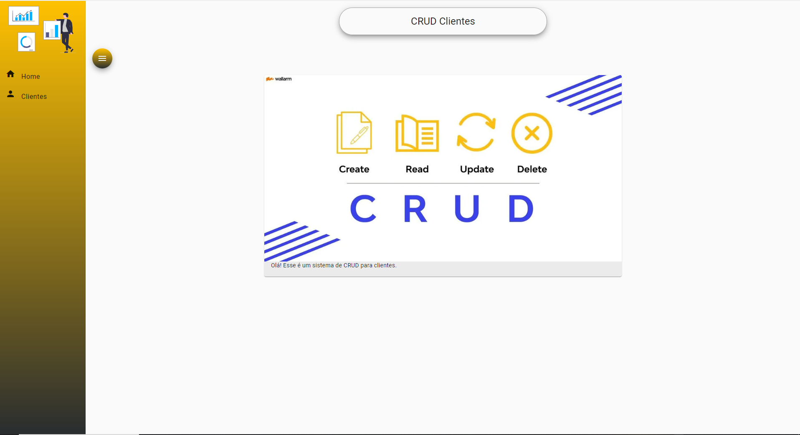
- 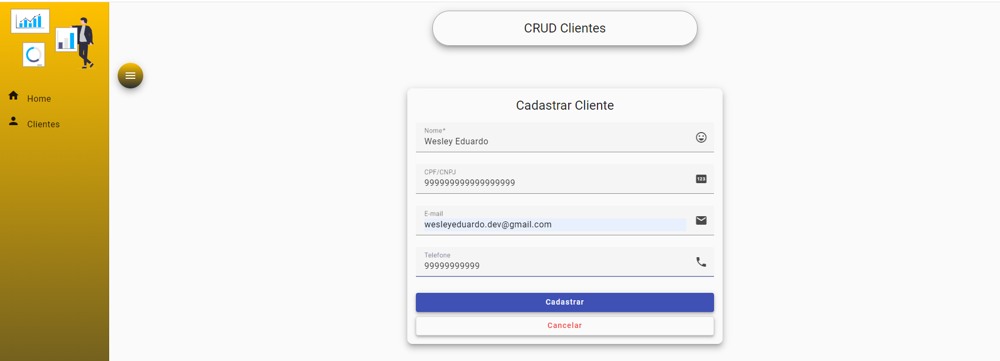
- 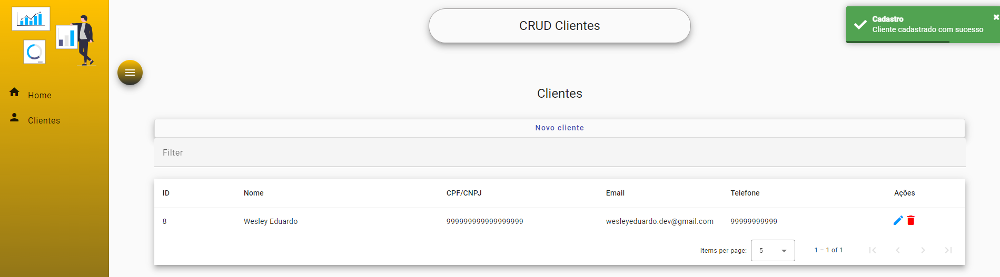
- 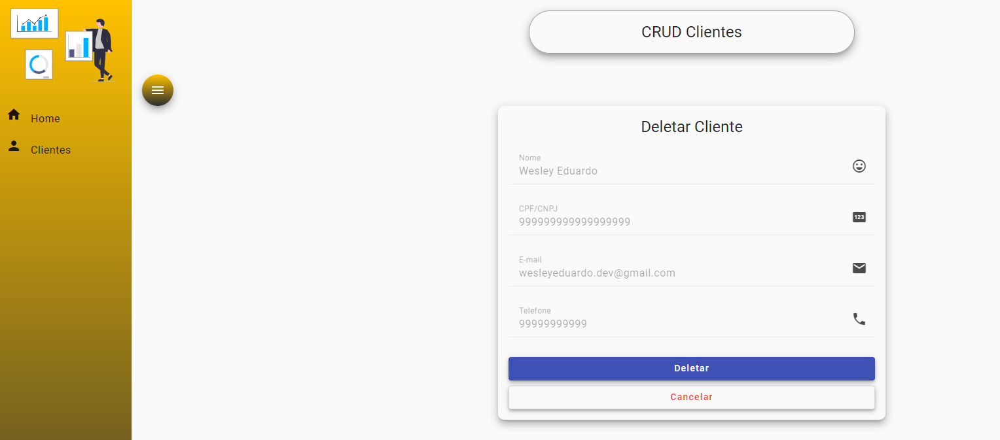

# Executar o projeto localmente
- O primeiro passo é Subir a API do CRUD de Clientes
  - Opção 1: Abrir pasta backend sem ser pelo terminal (explorar via windows) e Executar o arquivo run-backend.sh
  - Opção 2: Abrir um terminal no diretório backend e executar: sh run-backend.sh
- Agora abra um terminal na raiz do projeto front end execute o comando "npm install" para instalar as dependências
- Ainda no terminal, execute "npm start"

# Subir o projeto via Docker
- O primeiro passo é Subir a API do CRUD de Clientes
  - Opção 1: Abrir pasta backend sem ser pelo terminal (explorar via windows) e Executar o arquivo run-backend.sh
  - Opção 2: Abrir um terminal no diretório backend e executar: sh run-backend.sh
- Agora abra um terminal na raiz do projeto frontend execute o comando "docker build -t wesleyeduardodev/crud-angular ." para gerar a imagem da aplicação
- Ainda no terminal na raiz do front, execute "docker compose up -d"

# Preparando aplicação angular para Deploy na AWS usando AmazonS3
- Antes de publicar na S3 é preciso que antes seja feito o deploy do backend na EC2 (Ver README do projeto backend).
- Após o deploy do backend, copie o DNS público gerado
- 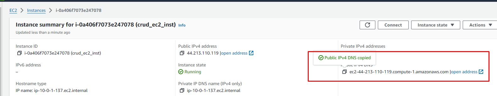
- Abra o arquivo frontend/src/app/config/api.config.ts e cole o valor do DNS público na variável URL_PROD
- Importante, colocar o "http:/" antes do DNS. Ficará da seguinte forma como um exemplo: http://ec2-3-239-241-205.compute-1.amazonaws.com
- Altere o valor da variável baseUrl para receber o valor da varivável URL_PROD
- O arquivo api.config.ts ficará conforme imagem abaixo
- 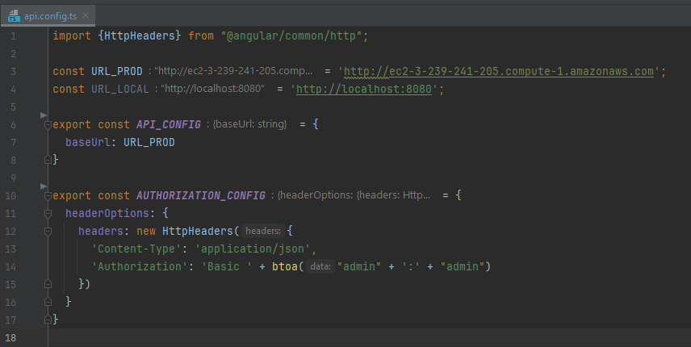
- Siga os demais passos abaixo

# Publicando no AmazonS3
- Entre na pasta raiz do projeto angular e execute o comando "ng build" para fazer o buil da aplicação (será gerada  pasta dist)
- Procure pelo serviço S3 e clique em Create Bucket
- 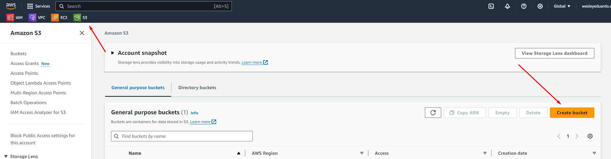
- Insira um nome para o bucket
- 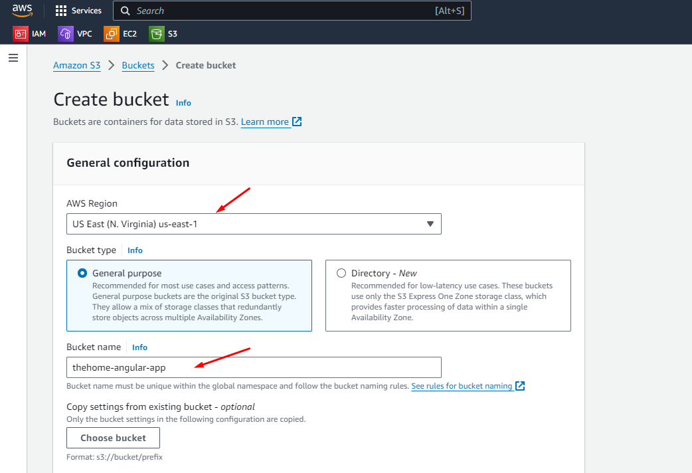
- Deixe as outras configurações como padrão e clique em Create Bucket 
- 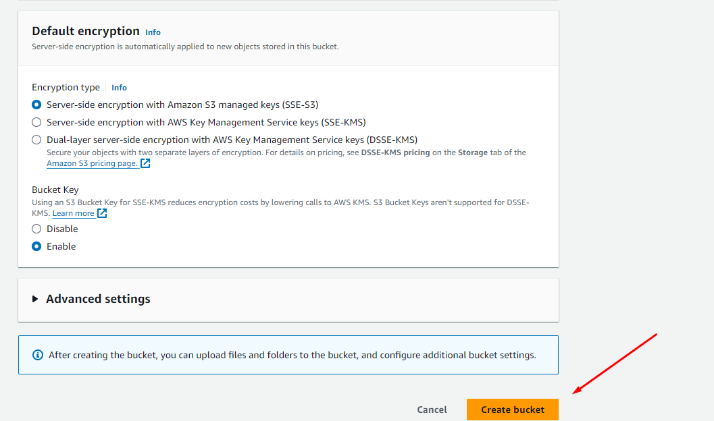
- Após a criação será mostrado na lista de buckets
- 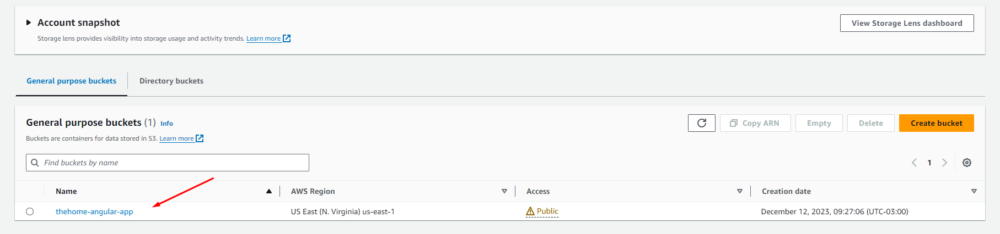
- Entre no bucket criado e faça upload de todos os arquivos dentro de pasta dist que foi gerada com o comando ng build
- Lembre de fazer o upload também da pasta assets
- 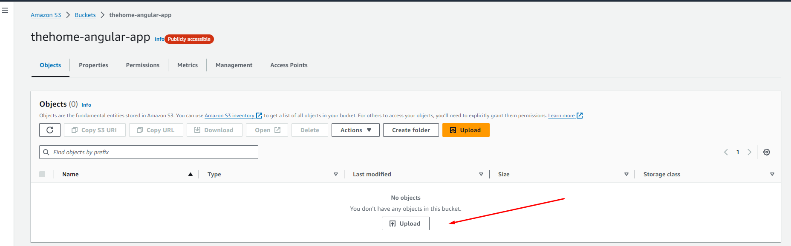
- 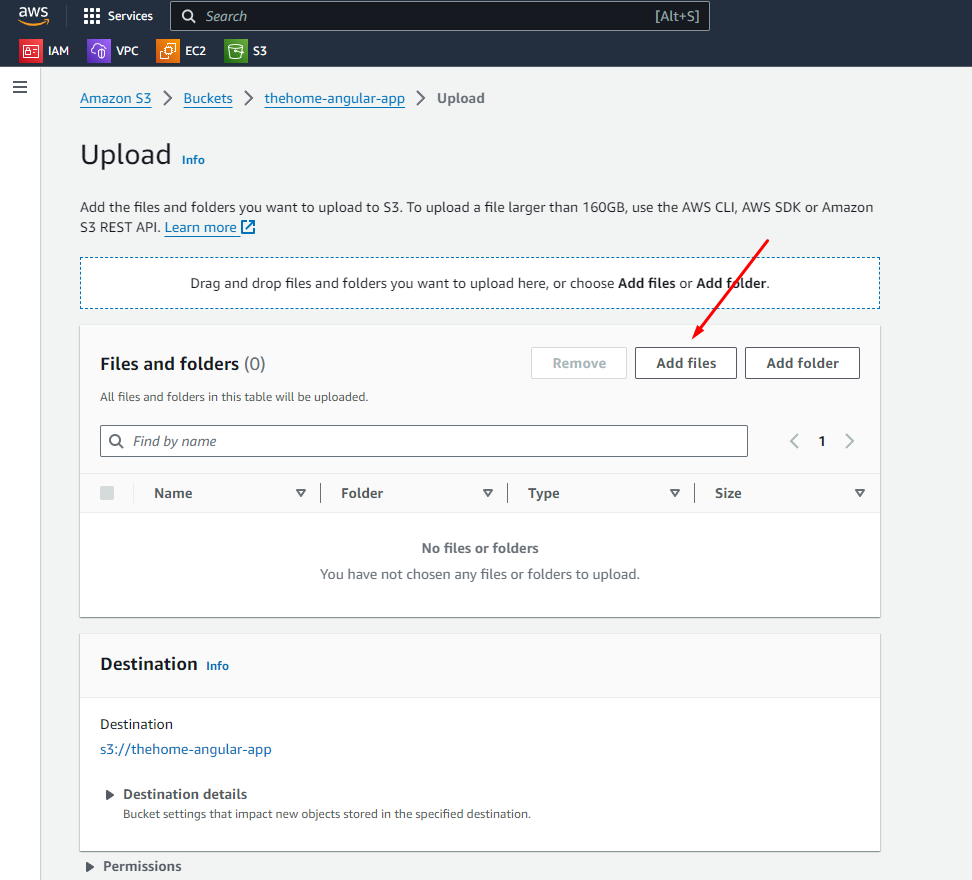
- 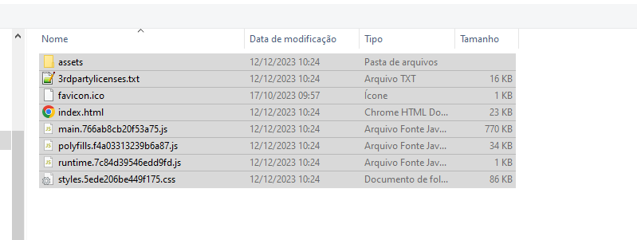
- 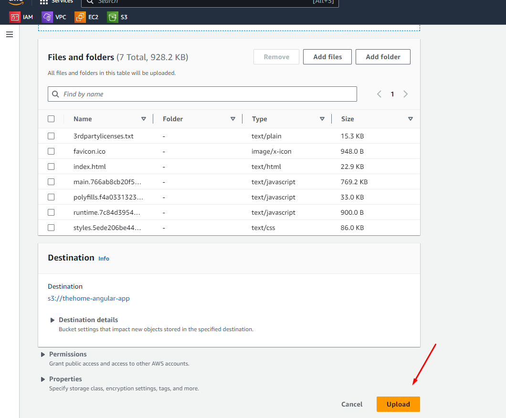
- 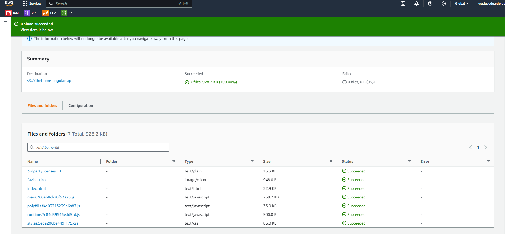
- Entre Properties > Static website hosting > Edit
- 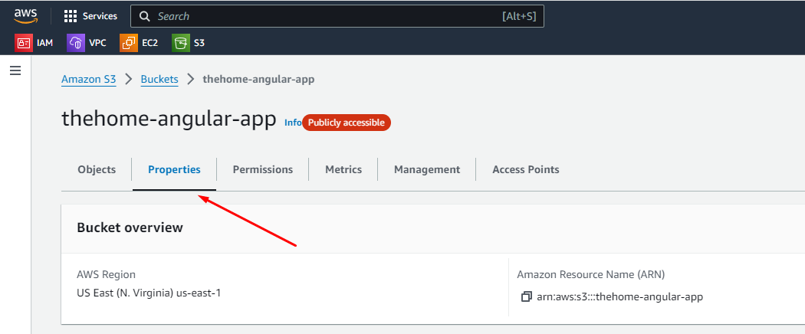
- Na página de edição, selecione enable para habilitar a hospedagem de sites estáticos. Preencha index.html nos campos Index e Error document e salve as alterações.
- 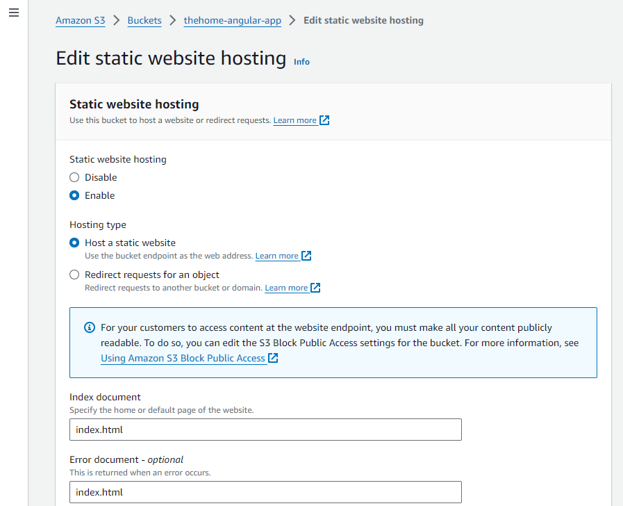
- Ao voltar na aba properties, uma URL terá sido criada:
- 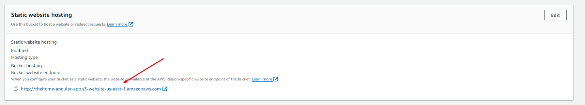
- Porém, ao tentar acessar, você verá a seguinte mensagem:
- 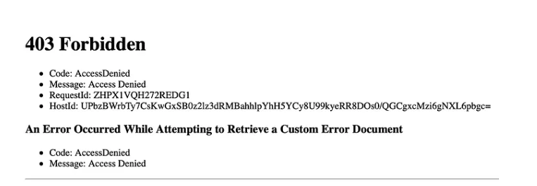
- Isso acontece porque todos os buckets são privados por padrão, tornando-os inacessíveis.
- Para alterar isso, ainda no Bucket, vamos precisar ir na aba Permissions > Block public access > Edit.
- 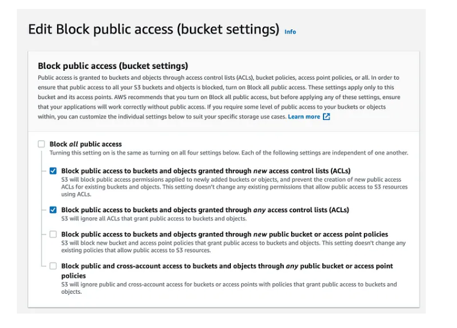
- Nessa tela, desmarcamos a opção Block all public access e deixamos marcado somente as opções
- Além disso, vamos precisar criar uma policy para garantir acesso anônimo para que os usuários possam acessar o bucket. Ainda na aba Permissions, vá em Bucket policy > Edit. Cole o conteúdo abaixo, substituindo a tag pelo nome do seu bucket:

```json
{
  "Version": "2012-10-17",
  "Statement": [
    {
      "Sid": "AllowPublicAccess",
      "Effect": "Allow",
      "Principal": "*",
      "Action": "s3:GetObject",
      "Resource": "arn:aws:s3:::crud-angular-app/*"
    }
  ]
}
```

- 
- Retorne na aba Properties e abra o link gerado
- 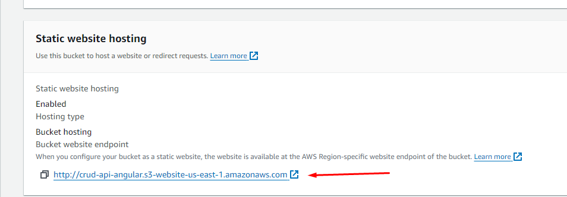

- 
- 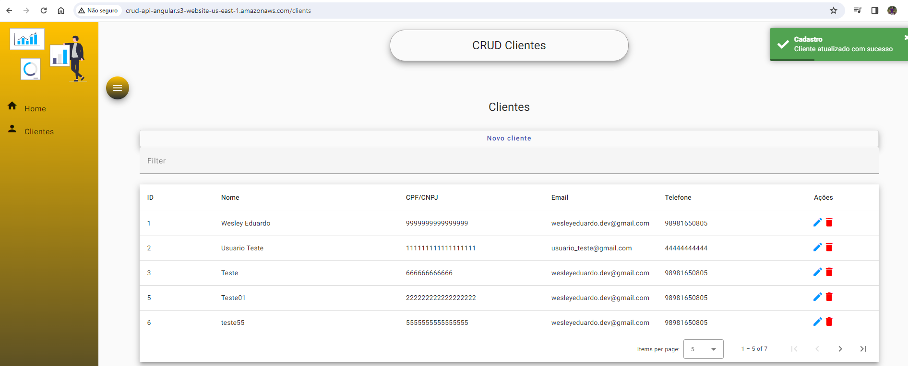

# Geração da imagem da aplicação
- Geração da imagem: docker build -t wesleyeduardodev/crud-angular .
- Execução do container: docker run -p 4200:4200 --name crud-angular wesleyeduardodev/crud-angular

# Comandos úteis
- Instalar o nodeJs: https://nodejs.org/en. Versão usada para executar o projeto: 18.18.2
- Verificar versão npm: npm -version
- Intalar Angular CLI: npm install -g @angular/cli

## Para analisar
- Melhorar a criação da imagem e container do angular. Está com tamanho grande e consumindo muita memória

## Development server

- Run `ng serve` for a dev server. Navigate to `http://localhost:4200/`. The application will automatically - reload if you change any of the source files.

## Code scaffolding

- Run `ng generate component component-name` to generate a new component. You can also use `ng generate directive|pipe|service|class|guard|interface|enum|module`.

## Build

- Run `ng build` to build the project. The build artifacts will be stored in the `dist/` directory.

## Running unit tests

- Run `ng test` to execute the unit tests via [Karma](https://karma-runner.github.io).

## Running end-to-end tests

- Run `ng e2e` to execute the end-to-end tests via a platform of your choice. To use this command, you need to first add a package that implements end-to-end testing capabilities.

## Further help

- To get more help on the Angular CLI use `ng help` or go check out the [Angular CLI Overview and Command Reference](https://angular.io/cli) page.
